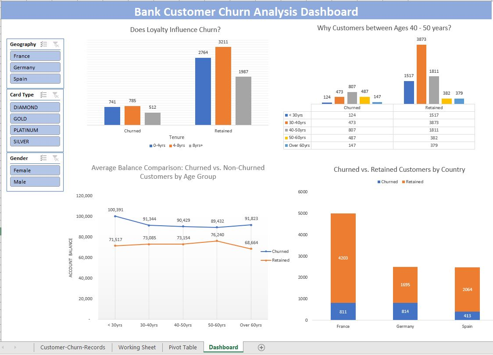
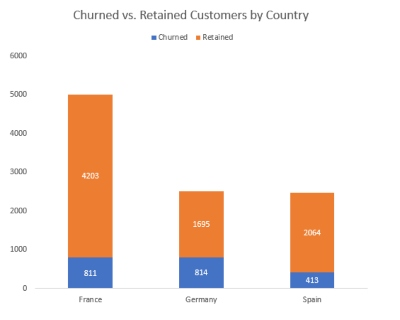
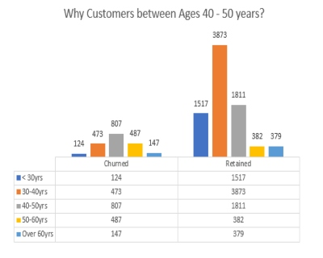
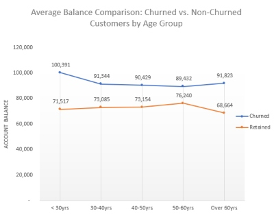
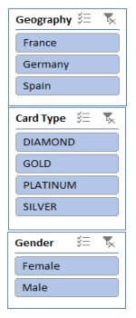

# customer-churn-excel-dashboard

### Overview
In this project, I have started off by cleaning and ensuring that the data is of optimal quality to carry out analysis and obtain insights utilizing pivot tables and creating a dashboard.
This dashboard provides an overview of customer churn data for a bank. The data is segmented by geography, age group, card type, tenure, and average balance. 
The dashboard identifies key trends and patterns in customer churn, which can be used to improve customer satisfaction and retention.
  

### Key insights:
- Customers in France are the most likely to churn, followed by those in Germany and Spain.

  
  
- Customers between the ages of 40 and 50 are the most likely to churn.

  
  
- Customers with the shortest tenure (0-4 years) are the most likely to churn.

  
  
- Churned customers have a lower average balance than retained customers.

  
  
### Benefits of this dashboard:
- Identifies key trends and patterns in customer churn
- Can be used to improve customer satisfaction and retention
- Easy to use and navigate
- Visually appealing

To view more information about a particular segment of the data, simply click on the corresponding bar or slice in the chart. 
  

You can also use the filters at the top of the dashboard to filter the data by geography, age group, card type, tenure, and average balance.
